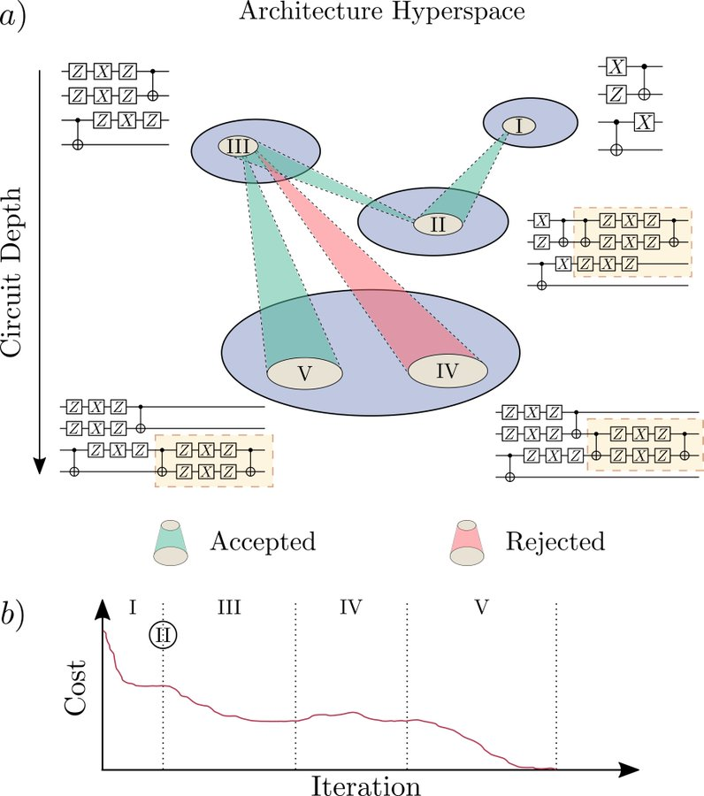
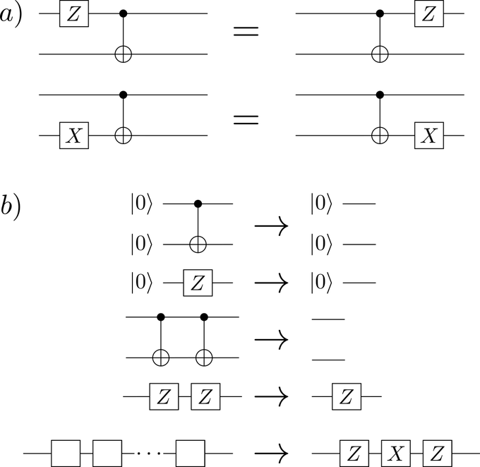
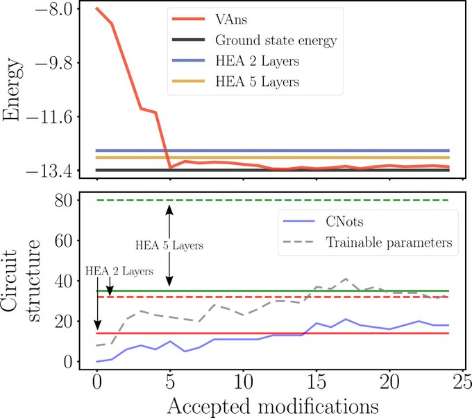

<br />
<p align="center">


  <h1 align="center">|VANs> </h3>

  <p align="center">
  <h2>A semi-agnostic ansatz with variable structure for quantum machine learning </h2>
    <br />
    <a href="https://arxiv.org/abs/2103.06712"><strong>Check out ArXiv preprint »</strong></a>
    <br />
    <br />
   <!-- <a href="https://github.com/othneildrew/Best-README-Template">View Demo</a> -->
  </p>
</p>

<!-- TABLE OF CONTENTS -->
<details open="open">
  <summary>Table of Contents</summary>
  <ol>
    <li>
      <a href="#overview">Overview</a>
      <ul>
        <li><a href="#built-with">Built With</a></li>
      </ul>
    </li>
    <li>
      <a href="#getting-started">Getting Started</a>
      <ul>
        <li><a href="#prerequisites">Prerequisites</a></li>
        <li><a href="#installation">Installation</a></li>
      </ul>
    </li>
    <li><a href="#usage">Usage</a></li>
    <li><a href="#contributing">Contributing</a></li>

  </ol>
</details>


<!-- ABOUT THE PROJECT -->
## Overview

How would you walk through the architecture hyperspace to find your favorite quantum circuit? How to do so when both intuition and gradients vanish? Just go for our Variable Ansatz (VAns) algorithm!
  <p align="center">

</p>
* QML trains a parametrized quantum circuit to solve a given problem, encoded in some cost function. Depending on the circuit, this approach can potentially run into trouble, since trainability issues and quantum hardware noise essentially forbid the cost function to be minimized.

* For this, we very much motivate the idea of optimizing both circuit parameters 𝗮𝗻𝗱 circuit structure in a semi-agnostic fashion :robot: :robot:.

* This consists on randomly placing blocks of gates in the circuit, and accept or reject those modifications if the cost function is actually lowered or not. Crucially, we prevent the circuit from over-growing by applying some circuit-compression rules in a problem-informed way.

<p align="center">

</p>

* In turn, this mechanism gets the most out of the available quantum resources. For example, in VQE, we find that cost value (energy) is lower than that of the circuits usually employed, if using the same resources.
<p align="center">

</p>

## Built With

This implementation of |VANs> has been written in Python 3, using
* [Cirq](https://quantumai.google/cirq)
* [TensorFlowQuantum](https://www.tensorflow.org/quantum)
* [OpenFermion](https://quantumai.google/openfermion)


<!-- GETTING STARTED -->
## Getting Started

How to use VANs on a local machine?

### Prerequisites

Have Python 3 installed.

### Installation

1. Clone the repo
   ```sh
   git clone https://github.com/matibilkis/qvans.git
   ```
2. Optional, but highly recommended. Create a virtual environment to avoid conflict with other dependencies
  ```sh
  python3 -m virtualenv {NameOfVirtualEnv}
  ```
  And activate the virtual environment
  ```sh
  source {NameOfVirtualEnv}/bin/activate.sh
  ```
3. Install libraries
   ```sh
   (NameOfVirtualEnv) pip3 install -r requirements.txt
   ```
4. Now you are ready to use VANs!
  ```sh
  (NameOfVirtualEnv) python3 meta_main.py
  ```


<!-- USAGE EXAMPLES -->
## Usage

The code we present comes with a series of pre-defined Hamiltonians and cost functions. It is up to the user to define new hamiltonians, which are Transverse Field Ising Model (TFIM), XXZ model, chemical hamiltonians (H2, H4, LiH) and the autoencoder.

Note that each of the pre-defined Hamiltonians has one (or more) free paramters, such as magnetic field strengths or bond lengths. This setting can be specified by parsing arguments to main.py file. For example, if willing to work with the TFIM, given by for a configuration of TFIM,

   <a href="https://www.codecogs.com/eqnedit.php?latex=H=-J\sum_{j=1}^n&space;\sigma_j^x\sigma_{j&plus;1}^x-g\sum_{j=1}^n&space;\sigma_j^x\,," target="_blank"></a>

for n=4, J=0.5, g=1, we get

  ```sh
  python3 main.py --problem TFIM --J 0.6 --g 1 --n_qubits 4
  ```
Importantly, the hyperparameters of the algorithm can be modified as well, feel free to peer at main.py file for all parsing arguments.

Finally, it is ussually of great utility to sweep over a certain parameter(s). To that end, we use the meta_main.py (where, at the cost of elegancy, some templates can be found under commented format). For instance, if willing to sweep over J values (say, from 0.5 to 1.5), one would modify meta_main.py by setting

    ```
    insts=[]
    js = np.arange(0.5,1.6,0.1)
    for J in js:
        problem_config = dict_to_json({"problem" : "TFIM", "g":1.0, "J": bond})
        instruction = "python3 main.py --n_qubits 4 --problem_config {}".format(problem_config)
        insts.append(instruction)
    ```
and consequently run it:

  ```sh
  python3 meta_main.py
  ```

<!-- CONTRIBUTING -->
## Contributing

Don't hesitate in getting in touch to contribute with this project :)
