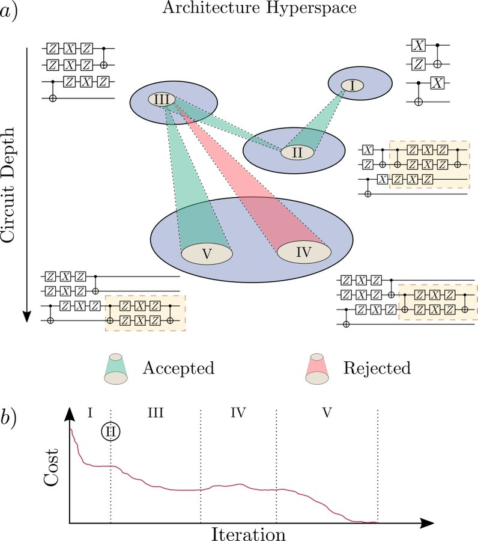

# VAns: Variable Ansatz for Variational Quantum Algorithms

[](https://arxiv.org/abs/2103.06712)
[](https://doi.org/10.1007/s42484-023-00132-1)
[](LICENSE)

> **A semi-agnostic ansatz with variable structure for variational quantum algorithms**

This repository contains the official implementation of **VAns (Variable Ansatz)**, a variable structure approach to build ansatzes for Variational Quantum Algorithms (VQAs). VAns applies a set of rules to both grow and remove quantum gates in an informed manner during optimization, making it ideally suited to mitigate trainability and noise-related issues by keeping the ansatz shallow.

## 📚 Citation

If you use VAns in your research, please cite:

```bibtex
@article{bilkis2023semi,
  title={A semi-agnostic ansatz with variable structure for variational quantum algorithms},
  author={Bilkis, M. and Cerezo, M. and Verdon, G. and Coles, P. J. and Cincio, L.},
  journal={Quantum Machine Intelligence},
  volume={5},
  number={43},
  year={2023},
  publisher={Springer},
  doi={10.1007/s42484-023-00132-1},
  arxiv={2103.06712}
}
```

## 🎯 Overview

VAns explores the hyperspace of architectures of parametrized quantum circuits to create short-depth ansatzes for VQA applications. The algorithm:

1. **Starts** with a (potentially non-trivial) initial circuit and optimizes its parameters until convergence
2. **Inserts** blocks of gates initialized to the identity, so that ansatzes at contiguous steps belong to an equivalence class
3. **Simplifies** the circuit by eliminating gates and finding the shortest circuit
4. **Accepts or rejects** modifications based on cost function improvements

This mechanism prevents circuits from over-growing and gets the most out of available quantum resources.

<p align="center">
  
</p>

## ✨ Features

VAns has been successfully applied to:

### 1. **Variational Quantum Eigensolver (VQE)**
- **Condensed Matter Systems**: Transverse Field Ising Model (TFIM), XXZ model
- **Quantum Chemistry**: H₂, H₄, LiH molecules
- Finds lower energy states than fixed-structure ansatzes using the same resources

### 2. **Quantum Autoencoder**
- Data compression for quantum states
- Optimizes circuit structure for efficient state encoding/decoding

### 3. **Unitary Compilation**
- Compiles target unitaries into optimized quantum circuits
- Reduces circuit depth while maintaining fidelity

## 🚀 Quick Start

### Prerequisites

- Python 3.7-3.9 (for TensorFlow Quantum compatibility)
- pip or conda

### Installation

1. **Clone the repository:**
   ```bash
   git clone https://github.com/matibilkis/qvans.git
   cd qvans
   ```

2. **Create a virtual environment (recommended):**
   ```bash
   python3 -m venv venv
   source venv/bin/activate  # On Windows: venv\Scripts\activate
   ```

3. **Install dependencies:**
   ```bash
   pip install -r requirements.txt
   ```

   For different TensorFlow Quantum versions, see [Version Management](#-version-management).

4. **Run VAns:**
   ```bash
   python3 main.py --problem TFIM --J 0.6 --g 1.0 --n_qubits 4
   ```

## 📖 Usage

### Basic VQE Example

For a Transverse Field Ising Model (TFIM) with 4 qubits, J=0.6, g=1.0:

```bash
python3 main.py --problem TFIM --J 0.6 --g 1.0 --n_qubits 4 \
    --reps 150 --qepochs 10000 --qlr 0.01
```

### Quantum Chemistry Example

For H₂ molecule at bond length 1.5 Å:

```bash
python3 main.py --n_qubits 4 --problem_config '{"problem": "H2", "geometry": [("H", (0., 0., 0.)), ("H", (0., 0., 1.5))], "multiplicity": 1, "charge": 0, "basis": "sto-3g"}' \
    --reps 200 --qepochs 10000
```

### Parameter Sweeps

Use `meta_main.py` to sweep over parameters:

```python
# Edit meta_main.py to customize sweeps
js = np.arange(0.5, 1.6, 0.1)
for J in js:
    problem_config = dict_to_json({"problem": "TFIM", "g": 1.0, "J": J})
    instruction = "python3 main.py --n_qubits 4 --problem_config {}".format(problem_config)
    insts.append(instruction)
```

Then run:
```bash
python3 meta_main.py
```

### Command-Line Arguments

#### General Configuration
- `--n_qubits`: Number of qubits (default: 8)
- `--reps`: Number of VAns iterations (default: 150)
- `--path_results`: Path to save results (default: "../data-vans/")
- `--problem_config`: JSON string with problem configuration

#### VQE Options
- `--qepochs`: Maximum training epochs per VQE (default: 10000)
- `--qlr`: Learning rate (default: 0.01)
- `--training_patience`: Early stopping patience (default: 1000)
- `--optimizer`: Optimizer choice: "adam", "sgd", "adagrad" (default: "adam")
- `--max_vqe_time`: Maximum time per VQE in seconds (default: 300)

#### VAns Hyperparameters
- `--initialization`: Initial ansatz: "hea", "separable", "xz" (default: "hea")
- `--init_layers_hea`: Number of initial HEA layers (default: 1)
- `--acceptance_percentage`: Energy improvement threshold for acceptance (default: 0.01)
- `--rate_iids_per_step`: Rate of identity insertions per step (default: 1.5)
- `--selector_temperature`: Temperature for gate selection (default: 10.0)
- `--wait_to_get_back`: Iterations before reverting to best circuit (default: 25)

## 📚 Tutorials

Interactive Jupyter notebooks are available in the `tutorials/` directory:

- **`0_introduction.ipynb`**: Basic circuit construction and VQE
- **`1_VANs_methods.ipynb`**: VAns algorithm components
- **`2_VANs_loop.ipynb`**: Complete VAns workflow

To run tutorials:
```bash
jupyter notebook tutorials/
```

## 🔬 Reproducibility

### Environment Setup

For reproducibility, we recommend using the exact versions specified in `requirements.txt`:

```bash
pip install -r requirements.txt
```

### Paper Results

The results from the paper can be reproduced using the default parameters. Key configurations:

- **TFIM**: `--problem TFIM --J 0.5 --g 1.0 --n_qubits 4`
- **XXZ**: `--problem XXZ --J 1.0 --g 1.0 --n_qubits 4`
- **H₂**: See quantum chemistry example above
- **H₄**: `--problem H4 --geometry [...] --n_qubits 8`

### Version Compatibility

| Component | Version | Notes |
|-----------|---------|-------|
| Python | 3.7-3.9 | Required for TFQ compatibility |
| TensorFlow | 2.3.1 | Compatible with TFQ 0.4.0 |
| TensorFlow Quantum | 0.4.0 | Primary version |
| Cirq | 0.9.1 | Quantum circuit library |
| OpenFermion | 1.0.0 | Quantum chemistry support |

## 🏗️ Project Structure

```
qvans/
├── main.py                 # Main VAns execution script
├── meta_main.py            # Parameter sweep script
├── requirements.txt        # Python dependencies
├── utilities/              # Core VAns modules
│   ├── variational.py     # VQE and Autoencoder classes
│   ├── evaluator.py       # Circuit evaluation and acceptance
│   ├── idinserter.py      # Identity insertion (growth)
│   ├── simplifier.py      # Circuit simplification
│   ├── unitary_killer.py  # Gate removal
│   ├── circuit_basics.py  # Basic circuit operations
│   ├── chemical.py        # Quantum chemistry Hamiltonians
│   └── qmodels.py         # Quantum neural network models
├── tutorials/              # Jupyter notebook tutorials
├── examples_repository/    # Example results
└── multivans/              # Experimental: Quantum combs (see below)
```

## 🔬 Experimental: MultiVAns (Quantum Combs)

**⚠️ Status: Experimental/Unfinished**

The `multivans/` directory contains an experimental extension of VAns for optimizing **quantum combs** with communication channels. This work extends VAns to multi-party quantum protocols.

**Note**: This code was previously maintained in a separate repository ([github.com/matibilkis/multivans](https://github.com/matibilkis/multivans)) but has been merged into this repository for convenience. The separate repository is no longer actively maintained.

### Important Notes

- **State**: Unfinished research code (4+ years old)
- **Framework**: Written in PennyLane (older version)
- **Compatibility**: May not work with current dependencies
- **Purpose**: Research exploration of quantum combs optimization

### MultiVAns Features

- Quantum channel discrimination
- Multi-party quantum protocols
- Circuit database representation
- Template-based circuit construction

### Usage Warning

MultiVAns is provided for research purposes only. The codebase:
- Uses older PennyLane APIs
- May require manual dependency resolution
- Has incomplete documentation
- Is not actively maintained

To explore MultiVAns:
```bash
cd multivans
# Review README.md for specific setup instructions
# Note: May require older dependency versions
```

## 🧪 Testing

Run basic functionality tests:

```bash
python3 -c "from utilities.variational import VQE; print('VQE import successful')"
python3 -c "from utilities.evaluator import Evaluator; print('Evaluator import successful')"
```

## 📊 Results

Example results are stored in `examples_repository/`. Each run generates:
- Circuit structures (`.pkl` files)
- Energy evolution (`.npy` files)
- Training metadata

## 🤝 Contributing

Contributions are welcome! Please feel free to submit a Pull Request. For major changes, please open an issue first to discuss what you would like to change.

## 📝 License

This software is provided for research and educational purposes. See the [LICENSE](LICENSE) file for details and disclaimers regarding government funding and use restrictions.

## 🙏 Acknowledgments

- Los Alamos National Laboratory (LANL)
- Sandbox@Alphabet for TPU-based Floq simulator access
- Port d'Informació Científica, Barcelona for computational resources

## 📧 Contact

For questions or issues, please open a GitHub issue or contact the authors.

## 📖 References

1. Bilkis, M., et al. "A semi-agnostic ansatz with variable structure for variational quantum algorithms." *Quantum Machine Intelligence* 5, 43 (2023).
2. Preskill, J. "NISQ-era and beyond." *Quantum* 2, 79 (2018).
3. Cerezo, M., et al. "Variational quantum algorithms." *Nature Reviews Physics* 3, 625-644 (2021).

---

**Note**: This implementation corresponds to the published paper. For the latest experimental features, see the `multivans/` directory (experimental status).
